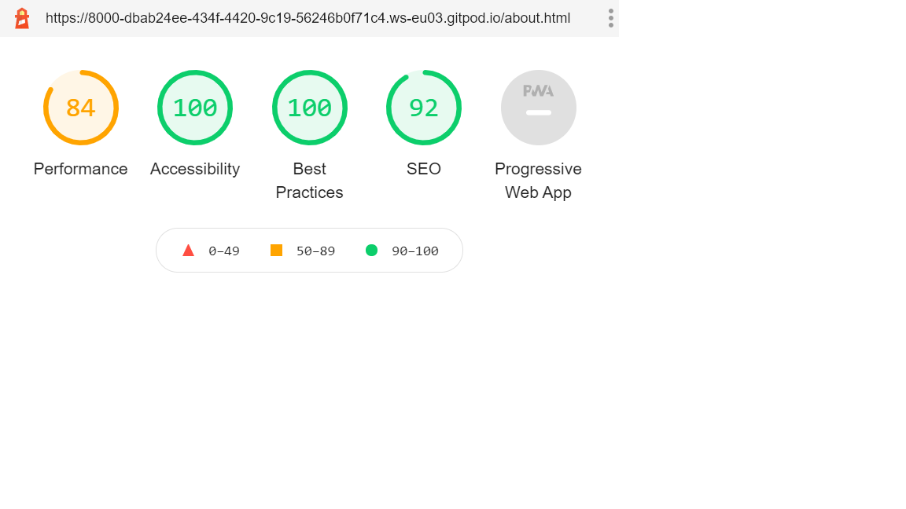

<h1 align="center">Explore Gothenburg</h1>
<h1 align="center"></h1>

-[Live Website](https://rubysrivastava.github.io/exploregothenburg/)

-[GitHub Repository](https://github.com/RubySrivastava/exploregothenburg/)
 
 ## About

This project is made for travellers who wants to travel to Gothenburg.
This website is made with the personal experience of site owner who lives in Gothenburg and explore it.
For site owners it will be utility to increase their presence over the internet which lead to increase their business by adding more content.
It is designed to be responsive on all devices and easy to navigate for users and owner.

## Table of Contents

[User Experience (UX)](#UX)

[Features](#features)

[Design](#design)

[Technologies Used](#technologies)

[Testing](#testing)

[Deployment](#deployment)

[Known Bugs](#bugs)

[Credits](#credits)

## User Experience (UX)

### User Stories

This website gives the very initial and essential information about Gothenburg. 
Any traveller who wants to come and explore Gothenburg then this website is perfect for him.
In this website he gets the information about attraction places and activity places.This site has a list of best restaurant in Gothenburg.
This site also provide the location and map of different places.

- ####  Generic Traveller
    1. I want to easily understand the purpose and the layout of the site without additional instructions needed.
    1. I want to intuitively navigate through the site to browse the content.
    1. I want the site is responsive on all device as I usually use phone for doing all such type of stuff.
    1. I want to be able to use the website on any device so I can keep it handy.
    1. I want to use the navigation at all times and have it readily available so I can quickly navigate from one page to another.
    1. I can easily find the location of different place.

- #### Tourist
    1. I want to know about basic information before visit like currency, language,weather and transport.
    1. I want to know about best place to visit there.
    1. I want to know about best place to go for different activity.
    1. I want to know about best place to eat and drink.
    1. I want to access images of Gothenurg to know more about this city.
    1. I want to access external social links to know traveller experiences.
    1. I want to get transport information about Gothenburg. 

- #### Local Traveller
    1. I want to know about beautiful place in near by Gotheburg.
    1. I want to explore different activities available in city.
    1. I want to access transportation.

- #### Business Traveller
    1. As a business traveller would like to know specific places to explore in the city within given time period.
    1. I want to know more about the food places near to my workplace.
    1. I want to know after work activity in city.

     
## Design

### Colour 
      
- #### This website is design for travellers who needs lots of motivation to travel.
    The main color which is used for header and footer is dark blue which shows trust to stay with it which is perfectly fit for travel guide.
    
    
    
- #### The black and white color is used for text-color and background-color which show intelligence and simplicity respectively.Because of this color the content looks simple and clear.
      
    
    
      
### Typography

- #### The main font used is a Roboto with sans-serif as a fallback font.
- #### The second font used is a Expo for brand name ,footer details and titles.

### Imagery

- #### 
    -[Image Optimizer](http://jpeg-optimizer.com/)

### Mockups

- #### Mockups were created using Adobe Xd.
    -[Desktop Wireframes](https://xd.adobe.com/view/07fb6c5c-9818-4af3-9d27-b273d6bfa607-52a8/)
    -[Mobile Wireframes](https://xd.adobe.com/view/3446a7e8-99bc-4ac8-b5e1-07ea6a2438f5-6115/)
- #### Mockup made through original website 
    -[Wireframes](https://techsini.com/multi-mockup/index.php)
    
    
    
    
    
    
    

## Features

### Existing Features

- #### Common Features Across All Pages

    - Header allows user to easily navigate across all pages
      - The header itself is positioned to always be visible (positioned absolutely using Bootstrap 'fixed-top' class) at the top of the screen (mobile and desktop) which allows visitors to find it quickly.
      - The brand logo is positioned on the left and is visible on all pages.
      - Navigation is included in the header to let the user intuitively locate it.
      - Navigation links is more visible when hovered over. This lets the visitor know that it is clickable.
      - The navigation link, matching the page that the user is visiting, stays 'active' to let the user quickly establish which page is visiting.
      - Navigation links collapse in a home menu when viewed on mobile device.
    
    - Accessibility
      - All Pages have a description in case the image link breaks as well as helps screen readers.
      - The home menu has aria-label added to let users with screen readers know where the toggleable menu is.
    
    - Buttons
      - All buttons are styled in the way to provide consistency across the page. 

    - Responsiveness
      - All Pages are responsive on different viewport size.

    - Footer
      - Footer has been designed to be at the bottom of the page, regardless of the amount of content. This aids the overall user experience.
      - All content has been spaced out and aligned to the center.
      - There are social links and when hovered over, it changed the color.

### Specific to Pages
- Home Page
    - This page has header, footer and a hero image in background with a video link. The header has navigation bar and footer has copyright and social links.The image brings the user's attention and inviting the user to explore the website.

- About Gothenburg Page
    - This page has very essential information about Gothenburg like currency, language, weather and transport.

- Attraction Page
    - This page has details about most attractive places.In Gothenburg, we have very nice archipelago, hilly area of mountain biking along with wind surfing. Last but not the least very beautiful city to cover by walk or taking a bike trip. Gothenburg is 400 year old city so you can have good number of museums, opera,and amusement parks. 

- Restaurant Page
    - This page has some famous and good place list to eat and drink which experienced by site owner himself.

- Explore Map Page
    - In this page user get the map of location just by selecting the location.

- contact Page
    - In this page user can contact to owner for more information.

### Future Features
  - A page where all the details of hotels and their rates and booking details.
  - A page to book a full trip plan for customer.
  - Create a way for the user to rate the website without having to type up feedback.
  - A page where people can review the comments.

## Technologies Used

### Languages Used

  - [HTML5](https://en.wikipedia.org/wiki/HTML5)
  - [CSS3](https://en.wikipedia.org/wiki/Cascading_Style_Sheets)
  - [JavaScript](https://en.wikipedia.org/wiki/Javascript)
  - [Jquery](https://en.wikipedia.org/wiki/JQuery)

### Frameworks, Libraries and Programs Used

  - [Bootstrap v4.5.0](https://getbootstrap.com/) - Used for the responsive layout as well as custom components such as header, footer, images, icons, grids, cards, and collapse element.
  - [Font Awesome](https://fontawesome.com/) - Font Awesome is used to add social icons for socila links and icons for about us page.
  - [Google Fonts](https://fonts.google.com/) - Google Fonts is used to import 'Expo'
  - [Git](https://git-scm.com/) - Git is used to allow for tracking of any changes in the code and for the version control.
  - [GitPod](https://www.gitpod.io/) - GitPod, connected to GitHub, hosted the coding space and allowed the project to be committed to the Github repository.
  - [Github](https://github.com/) - GitHub is used to host the project files and publish the live website by using Git Pages.
  - [Adobe Xd](https://www.adobe.com/ie/products/xd.html) - Adobe Xd is used to create mockups.

## Testing

### Functionality Testing
  - #### Navigation bar
     - The navigation bar stays at the top of the page on all screen sizes.
            - When the nav links clicks it opens the relevent page in same window with same header footer.
  - #### Footer
     - Footer is located at the bottom of the page regardless of the content amount.
     - When the social links are clicked, they open the relevant social media page in a new tab.
  
  - All external links is tested to make sure they open up the correct pages in new tabs.
  - All internal links is tested to make sure that all pages are correctly connected.
    
### CSS3 validator 
Validate by direct input 
    [CSS Validator](https://jigsaw.w3.org/css-validator/)
  - Test result : No Error Found But Warning

### HTML5 validator
Vaidate by direct input 
    [HTML5 Validator](https://validator.w3.org/#validate_by_input)
  - Home Page Result : Pass 
  - About Gothenburg Page Result : Pass
  - Attraction Page Result : Pass
  - Restaurant Page Result : Pass  
  - Explore Map Page Result : Warning
  - Contact Page Result : Pass

### JavaScript validator
Validate by direct input
    [JavaScript Validator](https://jshint.com/)
  - Test result : No Error Found But Warning

### Usability Testing
  - This website is shared on slack channel to get the feedback.This is also shared with friends to check on different device and accessbility.

### Compatibility Testing
  - #### Browser Compatibility
    - Tested on Chrome, Firefox, Opera, Internet Explorer, Microsoft Edge, Safari.
  - #### OS Compatibility
    - Tested on iOS , Android 10 and Windows 10.
  - #### Tested for responsivness on [Chrome DevTools](https://developers.google.com/web/tools/chrome-devtools). 

### Performance Testing
  - #### Tested on Developer Tools Lighthouse.
    - To run a report

        1. Download Google Chrome for Desktop.
        2. In Google Chrome, go to the URL you want to audit. You can audit any URL on the web.
        3. Open Chrome DevTools.
        4. Click the Audits tab.
        5. To the left is the viewport of the page that will be audited. To the right is the Audits panel of Chrome DevTools, which is now powered by Lighthouse.
        6. Click Perform an audit. DevTools shows you a list of audit categories. Leave them all enabled.
        7. Click Run audit. After 30 to 60 seconds, Lighthouse gives you a report on the page.

  - #### A Lighthouse report in Chrome DevTools
    - Home Page Dektop and Mobile

     
     

    - About Gothenburg Page Dektop and Mobile

     
     

    - Attraction Page Dektop and Mobile

      
      

    - Restaurant Page Dektop and Mobile

      
      

    - Explore Map Page Dektop and Mobile

      
      

    - Contact Page Dektop and Mobile
   
      
      

    
### Testing User Stories 
- #### Generic Traveller
    - I easily understand the purpose and the layout of the site without additional instructions needed.
    - The landing page is simple and clear with a video link of attraction places. 
    - All pages of website has navigation bar and footer. 
    - With navigation bar I can easily access diiferent page and go anywhere from present page and come back.
    - Footer has social link. If I click on link it open the relevant page on different tab so I can easily check the social activity.
    - I want to access external links and be able to learn more about each page.
        - Home Page
            - Home page provides the video link which cover the attractions of Gotheburg.
        - About Gothenburg Page
            - About us page provides me all essential information of Gothenburg.There I find the language currency and weather details. I also find about transport and how to use and take it. When I click on read more link it reaches the official website page of relevant page.
        - Attraction Page
            - Attraction page provides me the list of most visited and famous spot of Gothenburg. There is also the list of activity like canoe and kayak.
        - Restaurant Page
            - Restaurant page gives me the list of good restaurant to eat and drink.
        - Explore Map Page
            - In this page I can easily find the map of selected location from the dropdown list.
        - Contact Page    
            - In this page I can contact to the owner of site for information by just filling the form with query.

- #### Tourist 
    - I get the basic information on about gothenburg page like currency, language, weather and transport.
    - I get the information about most visiting place in attraction page.
    - I get the information about best place to eat and drink in eat & drink page.
    - At home page I get the link of a video which cover most attractive place of gothenburg.
    - I get the social links i footer for more experience of other traveller.

- #### Local Traveller 
    - I get most visited attraction list in attraction page.
    - I get most doing activity in attraction page.
    - I get the transport information in about gothenburg page.
    
- #### Business Traveller
    - As a business traveller I have limited time so I get the well organised and interest base disvided attraction places in attraction page.   
    - I get the best restaurant list by my choice type within city. 

## Deployment

- ### Publishing
  This website was published using [GitHub Pages](https://pages.github.com/). The procedure is outlined below.
  1. Go to the GitHub website and log in.
  2. On the left-hand side, you'll see all your repositories, select the appropriate one. ([Repository](https://github.com/RubySrivastava/exploregothenburg/) used for this project).
  3. Under the name of your chosen Repository you will see a ribbon of selections, click on 'Settings' located on the right hand side.
  4. Scroll down till you see 'GitHub Pages' heading.
  5. Under the 'Source' click on the dropdown and select 'master branch'
  6. The page will reload and you'll see the link of your published page displayed under 'GitHub' pages.
  7. It takes a few minutes for the site to be published, wait until the background of your link changes to a green color before trying to open it.

- ### Forking
  If you wish to contribute to this website you can Fork it without affecting the main branch by following the procedure outlined below.
  1. Go to the GitHub website and log in.
  2. Locate the [Repository](https://github.com/RubySrivastava/exploregothenburg/) used for this project.
  3. On the right-hand side of the Repository name, you'll see the 'Fork' button. It's located next to the 'Star' and 'Watch' buttons.
  4. This will create a copy in your personal repository.
  5. Once you're finished making changes you can locate the 'New Pull Request' button just above the file listing in the original repository.

- ### Cloning 
  If you wish to clone or download this repository to your local device you can follow the procedure outlined below.
  1. Go to the GitHub website and log in.
  2. Locate the [Repository](https://github.com/RubySrivastava/exploregothenburg/) used for this project.
  3. Under the Repository name locate 'Clone or Download' button in green.
  4. To clone the repository using HTTPS click the link under "Clone with HTTPS".
  5. Open your Terminal and go to a directory where you want the cloned directory to be copied in.
  6. Type `Git Clone` and paste the URL you copied from the GitHub.
  7. To create your local clone press `Enter`

## Known Bugs

There are no identified bugs as at now.

## Credits

### Code :

- Bootstrap library was used to create a responsive design. 
- Code snippet for back to top button(for about.html & attraction.html) taken from [w3Scools website](https://www.w3schools.com/) 
- Code snippet for map taken from [google cloud platform](https://cloud.google.com/)
- Code snippet for lightbox taken from [w3Scools website](https://www.w3schools.com/)

### Content :

- All code was written by the Ruby Srivastava.

- To write up a README file the most helpful documents were
    - Code Institute [SampleREADME](https://github.com/Code-Institute-Solutions/SampleREADME)
    - Code Institute [README Template](https://github.com/Code-Institute-Solutions/readme-template)
    - [Markdown Cheatsheet](https://github.com/adam-p/markdown-here/wiki/Markdown-Cheatsheet#code)
    
- To write up the content of page the most helpful site is
    - Goteborg Official Page [Official Website](https://www.goteborg.com/)
    

### Media :
- Some images used were taken from [UnSplash website](https://unsplash.com/)
- Some images clicked by developer(Ruby Srivastava) itself.

### Acknowledgements :

- I was inspired by the people of surrounding me who are very much enthusiastic and curious travellers.
- Thanks to my fellow student and tutors on slack channel who helped me in some way.
- Thanks to my mentor Maranatha Ilesalnmi for helping me throughout the project and giving me important suggestions and feedback of my work.
 

