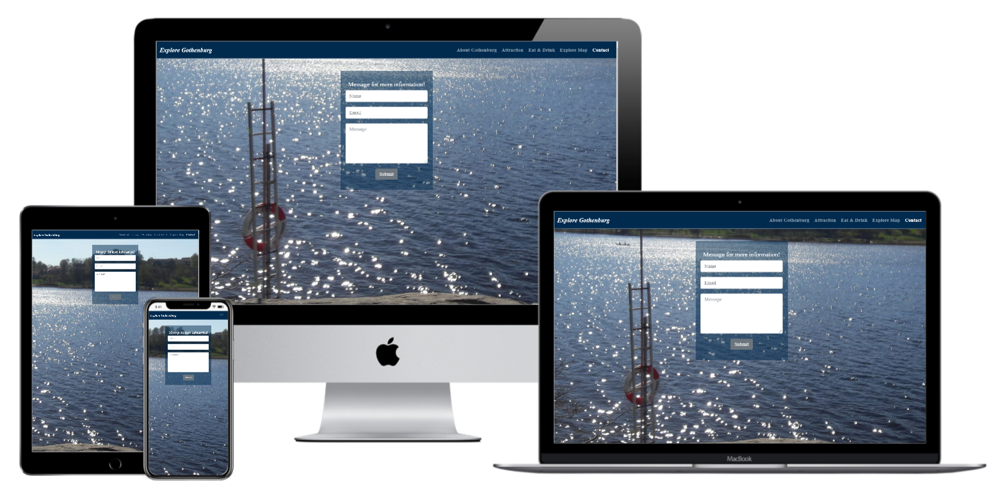

<h1 align="center">Explore Gothenburg</h1>
<h1 align="center"></h1>

-[Live Website](https://rubysrivastava.github.io/exploregothenburg/)

-[GitHub Repository](https://github.com/RubySrivastava/exploregothenburg/)
 
 ## About

## Table of Contents

[User Experience (UX)](#UX)

[Features](#features)

[Design](#design)

[Technologies Used](#technologies)

[Testing](#testing)

[Deployment](#deployment)

[Known Bugs](#bugs)

[Credits](#credits)

## User Experience (UX)

### User Stories

- ####  
    1. I want to easily understand the purpose and the layout of the site without additional instructions needed.
    1. 

- #### 
    1.

- #### 
    1. 

- #### 
    1.

     
## Design

### Colour 
      
- #### 
    
      
    
    
- #### 
      
    
    
    
      

### Typography

- #### The main font used is a Roboto with sans-serif as a fallback font.
- #### The second font used is a Expo for brand name ,footer details and titles.

### Imagery

- #### 
    -[Image Optimizer](http://jpeg-optimizer.com/)

### Mockups

- #### Mockups were created using Adobe Xd.
    -[Desktop Wireframes](https://xd.adobe.com/view/6fd631a7-5485-457b-bd28-9d3cc5bb0178-3a85/)
- #### Mockup made through original website 
    -[Wireframes](https://techsini.com/multi-mockup/index.php)
    
    
    
    
    
    
    

## Features

### Existing Features

- #### Common Features Across All Pages

    - Header allows user to easily navigate across all pages
      - The header itself is positioned to always be visible (positioned absolutely using Bootstrap 'fixed-top' class) at the top of the screen (mobile and desktop) which allows visitors to find it quickly.
      - The brand logo is positioned on the left and is visible on all pages.
      - Navigation is included in the header to let the user intuitively locate it.
      - Navigation links is more visible when hovered over. This lets the visitor know that it is clickable.
      - The navigation link, matching the page that the user is visiting, stays 'active' to let the user quickly establish which page is visiting.
      - Navigation links collapse in a home menu when viewed on mobile device.
    
    - Accessibility
      - All Pages have a description in case the image link breaks as well as helps screen readers.
      - The home menu has aria-label added to let users with screen readers know where the toggleable menu is.
    
    - Buttons
      - All buttons are styled in the way to provide consistency across the page. 

    - Responsiveness
      - All Pages are responsive on different viewport size.

    - Footer
      - Footer has been designed to be at the bottom of the page, regardless of the amount of content. This aids the overall user experience.
      - All content has been spaced out and aligned to the center.
      - 

### Specific to Pages
- #### Common Features Across All Pages
    - Home
      - 

    - About Gothenburg
      - 
    - Attraction
      - 

    - Restaurant
      - 

    - Explore Map
      - 

    - contact
      -

### Future Features

  - Ongoing implementation of user feedback.
  - Create a way for the user to rate the website without having to type up feedback.
  - A page where people can review the comments.

## Technologies Used

### Languages Used

  - [HTML5](https://en.wikipedia.org/wiki/HTML5)
  - [CSS3](https://en.wikipedia.org/wiki/Cascading_Style_Sheets)

### Frameworks, Libraries and Programs Used

  - [Bootstrap v4.5.0](https://getbootstrap.com/) - Used for the responsive layout as well as custom components such as header, footer, images, icons, grids, cards, and collapse element.
  - [Font Awesome](https://fontawesome.com/) - Font Awesome is used to add social icons for socila links and icons for about us page.
  - [Google Fonts](https://fonts.google.com/) - Google Fonts is used to import 'Expo'
  - [Git](https://git-scm.com/) - Git is used to allow for tracking of any changes in the code and for the version control.
  - [GitPod](https://www.gitpod.io/) - GitPod, connected to GitHub, hosted the coding space and allowed the project to be committed to the Github repository.
  - [Github](https://github.com/) - GitHub is used to host the project files and publish the live website by using Git Pages.
  - [Adobe Xd](https://www.adobe.com/ie/products/xd.html) - Adobe Xd is used to create mockups.

## Testing

### Functionality Testing
  - #### Navigation bar
     - The navigation bar stays at the top of the page on all screen sizes.
            - When the nav links clicks it opens the relevent page in same window with same header footer.
  - #### Footer
     - Footer is located at the bottom of the page regardless of the content amount.
     - When the social links are clicked, they open the relevant social media page in a new tab.
  
  - All external links is tested to make sure they open up the correct pages in new tabs.
  - All internal links is tested to make sure that all pages are correctly connected.
    
### CSS3 validator 
Validate by direct input 
    [CSS Validator]("https://jigsaw.w3.org/css-validator/")
  - Test result : No Error Found But Warning

### HTML5 validator
Vaidate by direct input 
    [HTML5 Validator]("https://validator.w3.org/#validate_by_input")
  - Home Page Result : Pass
  - About Gothenburg Page Result : Pass
  - Attraction Page Result : Pass
  - Restaurant Page Result : Pass  
  - Explore Map Page Result : Warning
  - Contact Result : Pass

### Usability Testing
  - This website is shared on slack channel to get the feedback.This is also shared with friends to check on different device and accessbility.

### Compatibility Testing
  - #### Browser Compatibility
    - Tested on Chrome, Firefox, Opera, Internet Explorer, Microsoft Edge, Safari.
  - #### OS Compatibility
    - Tested on iOS , Android 10 and Windows 10.
  - #### Tested for responsivness on [Chrome DevTools](https://developers.google.com/web/tools/chrome-devtools). 

### Performance Testing
  - #### Tested on Developer Tools Lighthouse.
    - To run a report

        1. Download Google Chrome for Desktop.
        2. In Google Chrome, go to the URL you want to audit. You can audit any URL on the web.
        3. Open Chrome DevTools.
        4. Click the Audits tab.
        5. To the left is the viewport of the page that will be audited. To the right is the Audits panel of Chrome DevTools, which is now powered by Lighthouse.
        6. Click Perform an audit. DevTools shows you a list of audit categories. Leave them all enabled.
        7. Click Run audit. After 30 to 60 seconds, Lighthouse gives you a report on the page.

  - #### A Lighthouse report in Chrome DevTools
    - Home Page Dektop and Mobile

     
     

    - About Gothenburg Page Dektop and Mobile

     
     

    - Attraction Page Dektop and Mobile

      
      

    - Restaurant Page Dektop and Mobile

      
      

    - Explore Map Page Dektop and Mobile

      
      

    - Contact Page Dektop and Mobile
   
      
      

    
### Testing User Stories 
- #### 
- #### 
- #### 

- #### 
        

## Deployment

- ### Publishing
  This website was published using [GitHub Pages](https://pages.github.com/). The procedure is outlined below.
  1. Go to the GitHub website and log in.
  2. On the left-hand side, you'll see all your repositories, select the appropriate one. ([Repository](https://github.com/RubySrivastava/exploregothenburg/) used for this project).
  3. Under the name of your chosen Repository you will see a ribbon of selections, click on 'Settings' located on the right hand side.
  4. Scroll down till you see 'GitHub Pages' heading.
  5. Under the 'Source' click on the dropdown and select 'master branch'
  6. The page will reload and you'll see the link of your published page displayed under 'GitHub' pages.
  7. It takes a few minutes for the site to be published, wait until the background of your link changes to a green color before trying to open it.

- ### Forking
  If you wish to contribute to this website you can Fork it without affecting the main branch by following the procedure outlined below.
  1. Go to the GitHub website and log in.
  2. Locate the [Repository](https://github.com/RubySrivastava/exploregothenburg/) used for this project.
  3. On the right-hand side of the Repository name, you'll see the 'Fork' button. It's located next to the 'Star' and 'Watch' buttons.
  4. This will create a copy in your personal repository.
  5. Once you're finished making changes you can locate the 'New Pull Request' button just above the file listing in the original repository.

- ### Cloning 
  If you wish to clone or download this repository to your local device you can follow the procedure outlined below.
  1. Go to the GitHub website and log in.
  2. Locate the [Repository](https://github.com/RubySrivastava/exploregothenburg/) used for this project.
  3. Under the Repository name locate 'Clone or Download' button in green.
  4. To clone the repository using HTTPS click the link under "Clone with HTTPS".
  5. Open your Terminal and go to a directory where you want the cloned directory to be copied in.
  6. Type `Git Clone` and paste the URL you copied from the GitHub.
  7. To create your local clone press `Enter`

## Known Bugs

There are no identified bugs as at now.

## Credits

### Code :

- Bootstrap library was used to create a responsive design. 

### Content :

- All code was written by the Ruby Srivastava.

- To write up a README file the most helpful documents were
    - Code Institute [SampleREADME](https://github.com/Code-Institute-Solutions/SampleREADME)
    - Code Institute [README Template](https://github.com/Code-Institute-Solutions/readme-template)
    - [Markdown Cheatsheet](https://github.com/adam-p/markdown-here/wiki/Markdown-Cheatsheet#code)
    
- All content was written by the coder after getting ideas from fitness website(Specially Nordic Wellness and Fitness27seven).

### Media :
- All images used were taken from [UnSplash website](https://unsplash.com/)

### Acknowledgements :

- 
- Thanks to my fellow student and tutors on slack channel who helped me in some way.
- Thanks to my mentor for helping me throughout the project and giving me important suggestions and feedback of my work.

